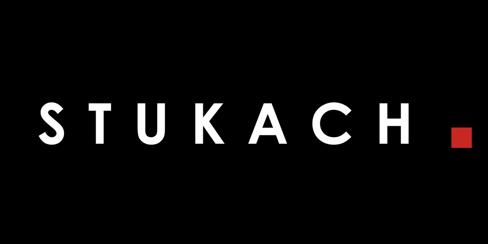
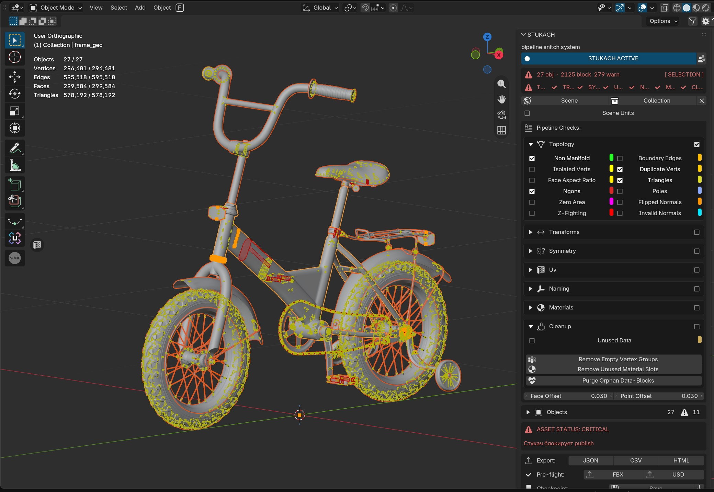
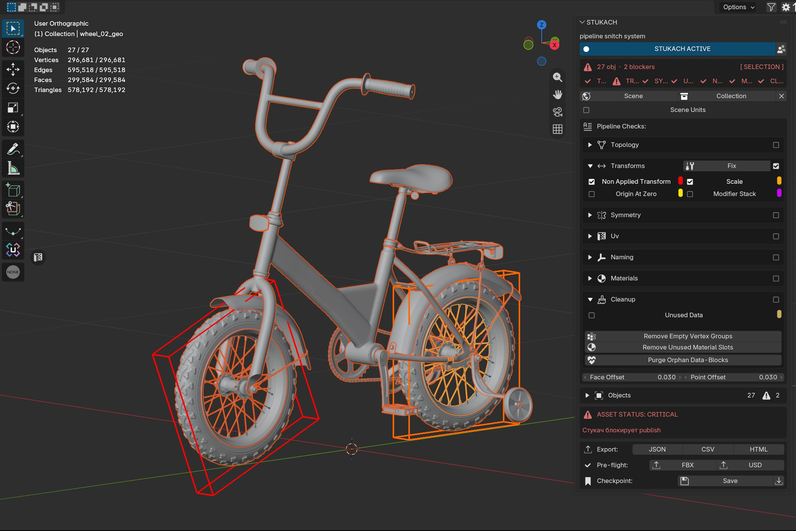
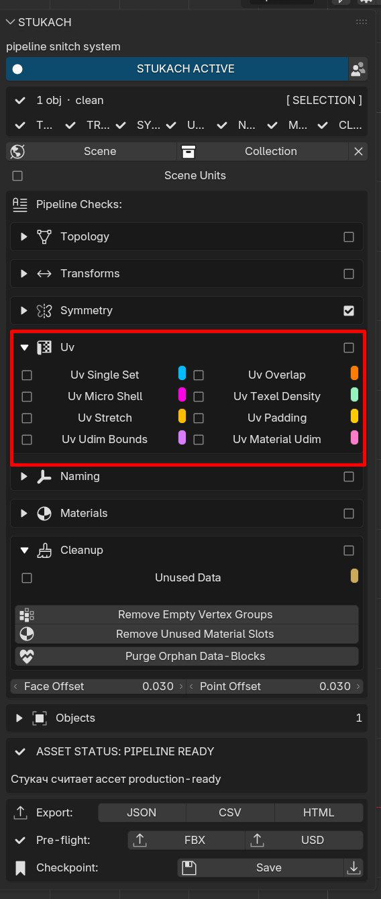
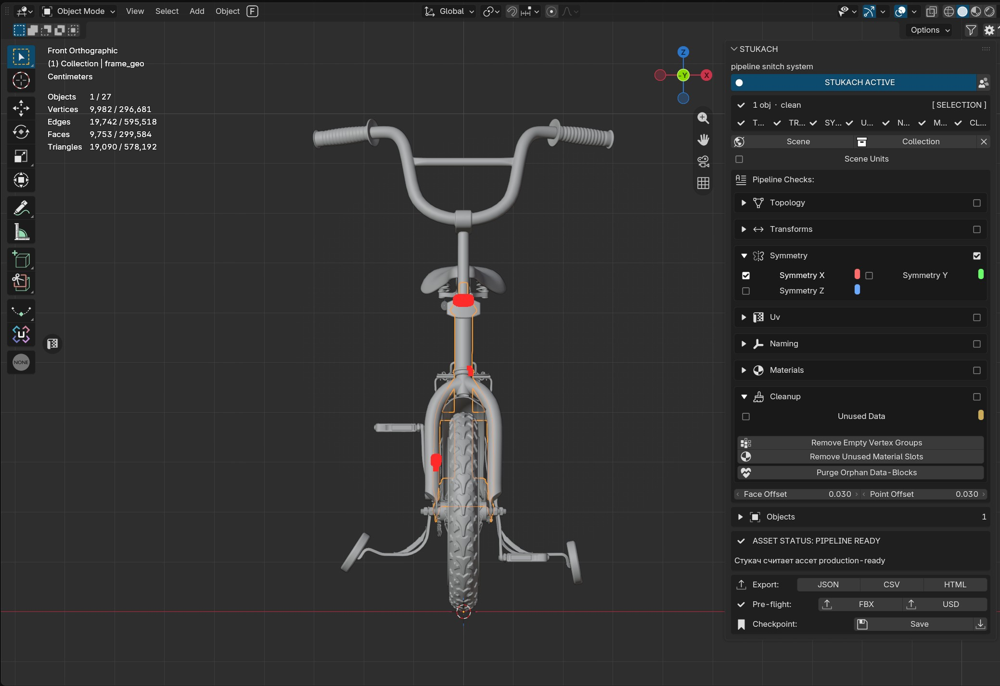
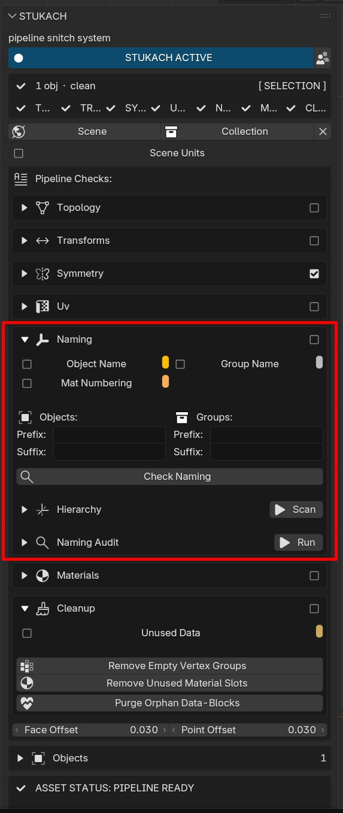

# STUKACH

Pipeline asset validation addon for Blender.

**Blender 5.2 · v1.6.5 · Author: Maksim Kovalev**

---

## Installation

Download `STUKACH.zip` from the [latest release](https://github.com/abyrvalg379/STUKACH/releases/latest).

**Option 1 — Drag & Drop:**
Drag `STUKACH.zip` into the Blender viewport.

**Option 2 — Menu:**
Edit → Preferences → Get Extensions → ⚙️ → Install from Disk → select `STUKACH.zip`

**Option 3 — Manual:**
Copy the `STUKACH` folder into `scripts/addons/`, then enable in Preferences → Add-ons.

The **STUKACH** tab appears in the N-Panel (View3D and UV Editor).

---

## Quick Start

1. Open the **STUKACH** tab in the N-Panel
2. Click **▶ RUN STUKACH**
3. Select objects in the viewport or use **Scene** / **Collection** scope buttons
4. Enable checkers — status dots show results (green ✓ / yellow / red)
5. Click **Sel** to select problem elements in Edit Mode

---

## Check Categories

### TOPOLOGY
| Check | Severity | Description |
|---|---|---|
| Non Manifold | BLOCKER | Edges shared by more than 2 faces |
| Boundary Edges | INFO | Edges with only 1 connected face |
| Isolated Verts | WARNING | Vertices with no connected edges |
| Duplicate Verts | BLOCKER | Coincident vertices within one connected shell (0.01mm) — different shells touching are intentional and not flagged |
| Face Aspect Ratio | INFO | Quad edge ratio exceeding threshold (default 6:1) |
| Triangles | INFO | Tris outside deformable/subdiv zones |
| Ngons | WARNING | Faces with more than 4 vertices |
| Poles | INFO | N-poles (3 edges), E-poles (5+ edges) |
| Zero Area | BLOCKER | Degenerate faces with near-zero area |
| Z-Fighting | BLOCKER | Coplanar overlapping geometry |

### TRANSFORMS
| Check | Severity | Description |
|---|---|---|
| Non Applied Transform | BLOCKER | Rotation not zeroed (freeze transforms needed) |
| Scale | BLOCKER | Scale not (1,1,1) |
| Origin at Zero | INFO | Object pivot not at world origin |
| Modifier Stack | WARNING | Unapplied modifiers (only Armature excluded) |

### SYMMETRY
| Check | Severity | Description |
|---|---|---|
| Symmetry X / Y / Z | INFO | KD-tree mirror vertex lookup |

### UV
| Check | Severity | Description |
|---|---|---|
| Single Set | WARNING | Mesh must have exactly 1 UV map |
| Overlap | BLOCKER | UV island intersection detection |
| Micro Shell | WARNING | UV islands smaller than ~6px at 2048 |
| Texel Density | INFO | TD in px/cm with target and tolerance |
| Stretch | WARNING | UV angle distortion (ZenUV algorithm) |
| Padding | INFO | Shell-to-shell and tile-border spacing |
| UDIM Bounds | BLOCKER | UV islands crossing UDIM tile boundaries |
| UV Material UDIM | BLOCKER | Different materials on the same UDIM tile |

### NAMING
| Check | Severity | Description |
|---|---|---|
| Obj Naming | WARNING | Object names must match naming policy |
| Col Naming | WARNING | Collection naming validation |
| Mat Numbering | WARNING | Catches `.001`, `.002` material suffixes |
| Mesh Data Name | WARNING | Mesh datablock must not keep auto names (`Mesh.101`) — one-click rename to `<object>_mesh`, suffix configurable |

### MATERIALS
| Check | Severity | Description |
|---|---|---|
| Mat Suffix | WARNING | Materials must end with `_mat` |
| Mat Assignment | BLOCKER | No unassigned material slots |
| Missing Textures | BLOCKER | Linked texture files must exist |

### CLEANUP
| Check | Severity | Description |
|---|---|---|
| Unused Data | WARNING | Orphaned data blocks |

---

## Severity Levels

| Level | Meaning |
|---|---|
| 🔴 BLOCKER | Asset cannot be delivered — must fix |
| 🟡 WARNING | Requires artist decision — review needed |
| 🔵 INFO | Awareness only — no status impact |

---

## Features

- **Live Mode** — checks re-run automatically as you edit, no manual re-run
- **Face Orientation** — Blender's built-in normals overlay, toggled from the panel
- **Check Presets** — native dropdown; save check sets + naming rules as files, share with the team
- **Next Issue** — one button jumps to the next problem object and frames it
- **Copy Summary** — validation report to the clipboard in one click
- **Health Strip** — per-category colored status dots in the score block
- **Progress Bar** — segmented bar while Scene/Collection validation runs
- **GPU Overlays** — colored face fills, edge outlines, and vertex markers in 3D viewport
- **UV Editor Overlays** — highlighted shells in the Image Editor
- **Select in Edit Mode** — click Sel to select problem geometry
- **Coordinator Mode** — filtered view showing only BLOCKER + WARNING checks
- **Export Reports** — JSON, CSV, HTML formats
- **Pre-flight Export** — FBX and USD validation before export
- **Checkpoints** — save and restore validation state
- **Ignore System** — suppress individual checks per object
- **Scene Units Check** — validates METRIC / METERS / scale 1.0

---

## Screenshots

---

## Preferences

Access via Edit → Preferences → Extensions → STUKACH ⚙️

- **Colors** — per-check color swatches for overlays
- **Offsets** — face and point overlay offsets
- **UV Padding** — shell and tile border thresholds
- **UV Stretch** — angle distortion threshold (radians)
- **Texel Density** — texture size, target TD, tolerance
- **Face Aspect Ratio** — quad ratio threshold

---

## Author

**Maksim Kovalev**

---

## Report Issues

Found a bug? [Open an issue](https://github.com/abyrvalg379/stukach/issues/new?template=bug_report.md)

---

## License

GPL-3.0-or-later

---

## 🔗 Related Tools

| Tool | Description |
|------|-------------|
| [STUKACH](https://github.com/abyrvalg379/STUKACH) | Pipeline asset validator for Blender |
| [LAMPOCHKA](https://github.com/abyrvalg379/LAMPOCHKA) | Scene light manager |
| [Switch_UDIM](https://github.com/abyrvalg379/Switch_UDIM) | Single ↔ UDIM texture switcher |
| [FLOMASTER](https://github.com/abyrvalg379/FLOMASTER) | OCIO launcher for DCC apps |
| [FILTER](https://github.com/abyrvalg379/FILTER) | Toggle visibility/selection by type, name, collection |
| [KARUSELKA](https://github.com/abyrvalg379/karuselka) | Fast camera turntable rig: orbit or object spin |
